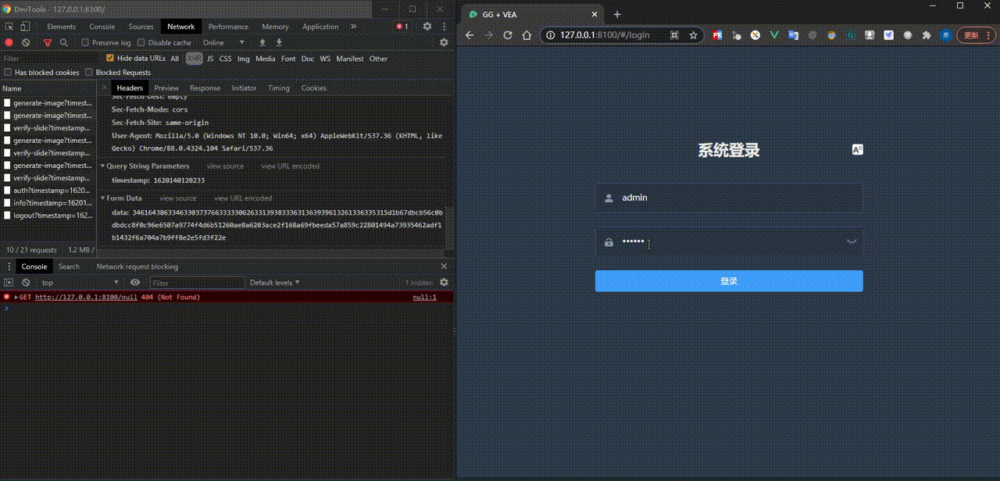

# 技术栈

## 前端

<p align="center">
  
</p>


vue-element-admin是用于管理界面的可用于生产环境的前端解决方案。它基于vue，并使用UI Toolkit元素-ui。

vue-element-admin基于最新的vue开发堆栈，并且具有内置的i18n解决方案，企业应用程序的典型模板以及许多出色的功能。它可以帮助您构建大型而复杂的单页应用程序。我相信无论您有什么需求，该项目都将为您提供帮助。

## 后端

<p align="center">
  
</p>
Gin是用Go（Golang）编写的Web框架。它具有类似于martini的API，其性能比[httprouter]（https：github.comjulienschmidthttprouter）快40倍。如果您需要性能和良好的生产率，您会爱上Gin的。

# 目录介绍
+ ```back``` Gin Web Framework（后端框架）
+ ```front``` Vue Element Admin（前端框架）
# 概述

这是一个前后端分离的项目，其主要特色是接口的数据请求和响应都带有对称加密（AES），另外还有一个行为效验滑块登录。其在后端运行环境，无须nginx或者apache第三方web服务。支持webpack编译后的资源与后端一起打包。

# 效果图



# 前端

```
# 进入到前端项目目录
cd front

# 安装依赖包
npm install

# 运行开发模式服务
npm run dev
```

这将自动打开http://localhost:9527

 **生产**

```
# 测试环境构建
npm run build:stage

# 生产环境构建，在webpack打包编译后，javascript-obfuscator会对dist目录下所有的.js文件做混淆和debug注入
npm run build:prod
```

# 后端

```
# 进入到后端项目目录
cd back

# 生成vendor目录
go mod vendor
# 运行服务
go run main.go
```
**生产**

```
# 编译可执行文件
# 参考地址：https://github.com/gobuffalo/packr#summing-it-up
packr build
```

# 特征

+ i18n
+ api-encrypted
+ vue+element admin
+ javascript-obfuscator
+ logging
+ jwt-go
+ gin
+ App configurable
+ gorm
+ RESTful API
+ packr

